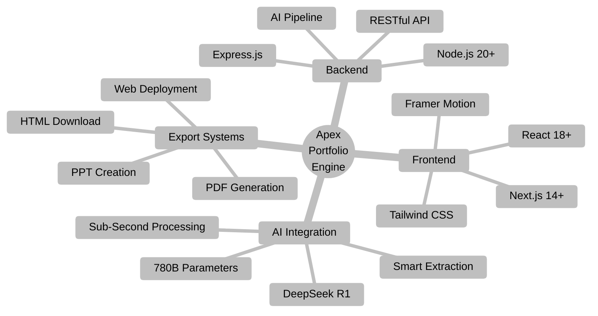

  

  
  
  
  
  

Apex Portfolio Engine revolutionizes professional portfolio creation through AI-powered automation. Built with <strong style="color: #5b21b6;">DeepSeek R1</strong> (780B parameters), it generates stunning, ATS-optimized portfolios in under one second from resume uploads.

 

  
| **Lightning Fast** | **AI Powered** | **Multi Export** | **ATS Ready** |
|:---:|:---:|:---:|:---:|
| Build portfolios in **1 second** vs traditional 5+ hours | Smart extraction with **99.8% accuracy** | PDF, PowerPoint, Web & HTML deployment | Optimized for applicant tracking systems |

 

 

## Core Features

 

<table width="95%">
<tr>
<td width="48%" valign="top" style="border: 2px solid #4F46E5; border-radius: 12px; padding: 25px; background: linear-gradient(135deg, #312e81 0%, #4F46E5 100%); box-shadow: 0 10px 25px rgba(79, 70, 229, 0.3);">

### Intelligent Resume Processing

**Transform your resume into a professional portfolio instantly**

 

- Drag & drop upload with multi-format support
- Context-aware parsing with 99.8% accuracy
- Smart content extraction and structuring
- Industry-specific optimization
- ATS keyword placement

 

### Real-Time Preview System

**See changes instantly as you build**

 

- Live updates with zero latency
- Side-by-side editing interface
- Auto-scroll to edited sections
- Visual validation before export
- WYSIWYG editing experience

</td>
<td width="4%"></td>
<td width="48%" valign="top" style="border: 2px solid #9333EA; border-radius: 12px; padding: 25px; background: linear-gradient(135deg, #581c87 0%, #9333EA 100%); box-shadow: 0 10px 25px rgba(147, 51, 234, 0.3);">

### Professional Templates

**Industry-optimized layouts for maximum impact**

 

- Multiple template designs
- Responsive and mobile-friendly
- Customizable color schemes
- Professional typography
- Clean, modern aesthetics

 

### Multi-Format Export

**Deploy anywhere, instantly**

 

- High-resolution PDF generation
- PowerPoint presentation creation
- Web deployment with custom domains
- Clean HTML download
- One-click publishing

</td>
</tr>
</table>

 

 

## AI Intelligence

 

  

 

<h2 style="color: #a5b4fc; font-size: 28px; margin-bottom: 15px; font-family: 'Segoe UI', 'Roboto', sans-serif;">DeepSeek R1 - 780 Billion Parameters</h2>

Our AI system provides unprecedented natural language processing capabilities for context-aware resume parsing, intelligent content extraction, and industry-specific optimization.

 

<table width="90%" style="margin: 20px auto;">
<tr>
<td align="center" width="20%" style="padding: 20px; background: rgba(79, 70, 229, 0.2); border-radius: 10px; border: 1px solid #4F46E5;">
<strong style="color: #c7d2fe; font-size: 16px;">Context-Aware Parsing</strong>  
Understands resume structure & formatting
</td>
<td width="2%"></td>
<td align="center" width="20%" style="padding: 20px; background: rgba(147, 51, 234, 0.2); border-radius: 10px; border: 1px solid #9333EA;">
<strong style="color: #c7d2fe; font-size: 16px;">Smart Extraction</strong>  
Identifies key skills & achievements
</td>
<td width="2%"></td>
<td align="center" width="20%" style="padding: 20px; background: rgba(79, 70, 229, 0.2); border-radius: 10px; border: 1px solid #4F46E5;">
<strong style="color: #c7d2fe; font-size: 16px;">Industry Optimization</strong>  
Tailors content for job sectors
</td>
<td width="2%"></td>
<td align="center" width="20%" style="padding: 20px; background: rgba(147, 51, 234, 0.2); border-radius: 10px; border: 1px solid #9333EA;">
<strong style="color: #c7d2fe; font-size: 16px;">ATS Keywords</strong>  
Strategic keyword placement
</td>
<td width="2%"></td>
<td align="center" width="20%" style="padding: 20px; background: rgba(79, 70, 229, 0.2); border-radius: 10px; border: 1px solid #4F46E5;">
<strong style="color: #c7d2fe; font-size: 16px;">Intelligent Formatting</strong>  
Maintains professional structure
</td>
</tr>
</table>

 

 

## The 6-Step Process

 

<table>
<tr>
<td align="center" width="33%">

### STEP 1
**Intelligent Upload**

 

Drag & drop resume 
Format recognition 
Multi-file support

</td>
<td align="center" width="33%">

### STEP 2
**AI Extraction**

 

99.8% accuracy 
Context-aware processing 
Smart data parsing

</td>
<td align="center" width="33%">

### STEP 3
**Layout Selection**

 

Industry templates 
Visual impact 
Professional designs

</td>
</tr>
<tr>
<td align="center" width="33%">

### STEP 4
**ATS Optimization**

 

90% compatibility 
Keyword placement 
Recruiter-friendly

</td>
<td align="center" width="33%">

### STEP 5
**Design Customization**

 

Color schemes 
Industry styling 
Brand personalization

</td>
<td align="center" width="33%">

### STEP 6
**Export & Deploy**

 

PDF, PPT, Web, HTML 
One-click deployment 
Custom domains

</td>
</tr>
</table>

 

 

## Technology Architecture

  
## Tech Stack

 

### Frontend Technologies

 

### Backend Technologies

 

### Development Tools

 

<table>
<tr>
<td align="center" width="50%">

**Frontend**

</td>
<td align="center" width="50%">

**Backend**

</td>
</tr>
</table>

 

 

 

## Performance Metrics

 

<table style="width: 95%; border-collapse: separate; border-spacing: 20px;">
<tr>
<td align="center" style="background: linear-gradient(135deg, #312e81 0%, #4F46E5 50%, #6366f1 100%); padding: 35px 25px; border-radius: 18px; box-shadow: 0 12px 30px rgba(79, 70, 229, 0.4); border: 2px solid #6366f1;">
<h2 style="color: #ffffff; margin: 0; font-size: 42px; font-weight: 800;">1 Second</h2>

Portfolio Generation

vs 5+ hours traditional
</td>
<td align="center" style="background: linear-gradient(135deg, #581c87 0%, #7c3aed 50%, #9333EA 100%); padding: 35px 25px; border-radius: 18px; box-shadow: 0 12px 30px rgba(147, 51, 234, 0.4); border: 2px solid #a855f7;">
<h2 style="color: #ffffff; margin: 0; font-size: 42px; font-weight: 800;">99.8%</h2>

AI Accuracy

Content extraction
</td>
<td align="center" style="background: linear-gradient(135deg, #1e3a8a 0%, #3b82f6 50%, #4F46E5 100%); padding: 35px 25px; border-radius: 18px; box-shadow: 0 12px 30px rgba(59, 130, 246, 0.4); border: 2px solid #60a5fa;">
<h2 style="color: #ffffff; margin: 0; font-size: 42px; font-weight: 800;">90%+</h2>

ATS Compatibility

Industry standard
</td>
<td align="center" style="background: linear-gradient(135deg, #6b21a8 0%, #9333EA 50%, #a855f7 100%); padding: 35px 25px; border-radius: 18px; box-shadow: 0 12px 30px rgba(168, 85, 247, 0.4); border: 2px solid #c084fc;">
<h2 style="color: #ffffff; margin: 0; font-size: 42px; font-weight: 800;">4 Formats</h2>

Export Options

PDF, PPT, Web, HTML
</td>
</tr>
</table>

 

 

# Quick Start

 

<table align="center" width="80%">
<tr>
<td align="center">

### Clone Repository
<pre><code>git clone https://github.com/mananjani2102/apex-portfolio-engine.git
</code></pre>

### Navigate to Directory
<pre><code>cd apex-portfolio-engine</code></pre>

### Install Dependencies
<pre><code>npm install</code></pre>

### Launch Development Server
<pre><code>npm run dev</code></pre>

### Build for Production
<pre><code>npm run build</code></pre>

### Start Production Server
<pre><code>npm start</code></pre>

</td>
</tr>
</table>

</td>
<td align="center" valign="middle">

</td>
</tr>
</table>

 

 

## Developer

 

<h3 style="color: #5b21b6; font-family: 'Segoe UI', 'Roboto', sans-serif;">Manan Jani</h3>

Full Stack Developer

 

<strong>Expertise:</strong> React.js | Next.js | Node.js | Express.js | UI/UX Design

 

<strong>Contributions:</strong> Frontend | Landing Page Design | Builder Interface | Export Systems | Deployment Automation

  

&nbsp;&nbsp;

&nbsp;&nbsp;

 

 

<h3 style="font-size: 18px; color: #C7D2FE; font-family: 'Segoe UI', 'Roboto', sans-serif; font-weight: 600; letter-spacing: 0.5px; margin-bottom: 10px;">
Developed by:-
</h3>

<h2 style="font-size: 32px; color: #E0E7FF; font-family: 'Poppins', 'Segoe UI', sans-serif; font-weight: 700; margin: 0;">
Manan Jani
</h2>

 

